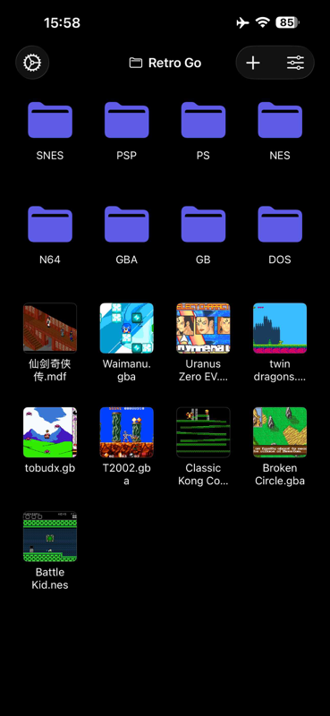
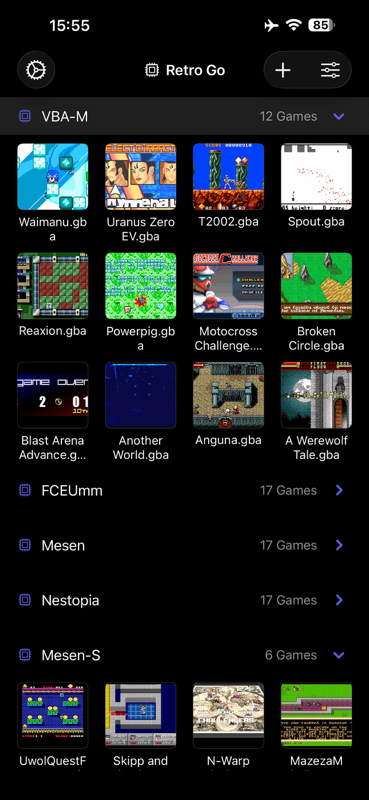
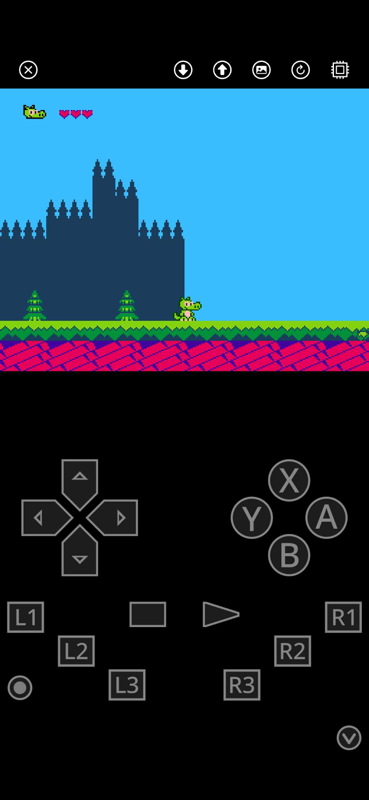
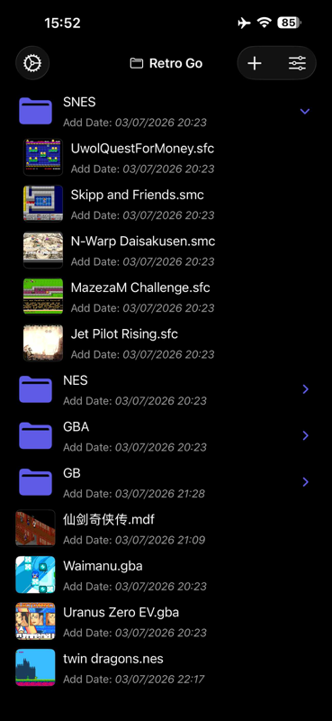
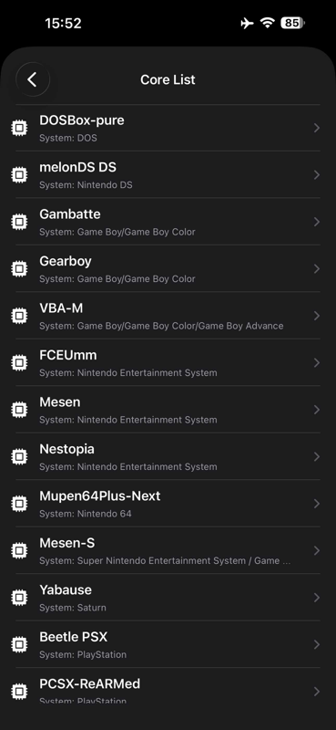
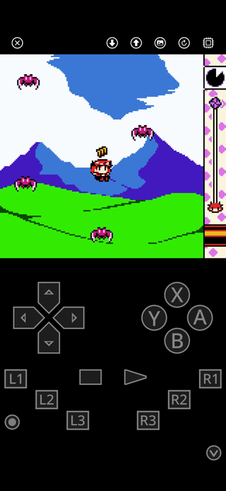

# RetroGo-iOS

[](LICENSE)

**A high-performance, native iOS frontend based on RetroArch (Libretro)**

[Simplified Chinese (简体中文)](README.zh-CN.md) | English

## 📖 Introduction

**RetroGo** is an open-source project designed to bring the power of the Libretro API to iOS with a truly native user experience. Unlike standard RetroArch ports, RetroGo performs a "surgical" architectural decoupling:

* **Deep Decoupling**: We have entirely removed RetroArch's native menu system (RGUI/XMB) and UI widgets.
* **Native Reconstruction**: While retaining RetroArch's powerful Core Environment and cross-platform bridging layer, the interactive UI is rebuilt from scratch using native **UIKit** (Swift/Objective-C).
* **Premium Experience**: This allows RetroGo to maintain top-tier Libretro compatibility while providing the fluid, intuitive feel of a modern iOS application.

## ⚠️ Disclaimer

* **Naming Notice**: This project is **NOT** affiliated with, endorsed by, or related to the [retro-go firmware for ESP32 devices](https://github.com/ducalex/retro-go). This is a standalone iOS application.
* **Content Notice**: RetroGo is a pure technical tool. We **do not bundle, provide, or distribute** any copyrighted game images (ROMs) or system firmware (BIOS).

## 🖼️ Screenshots








## ✨ Features

* **Native iOS UI**: Built with UIKit for a responsive and platform-consistent navigation experience.
* **Libretro Integration**: Utilizes the industry-standard Libretro API for high-performance emulation.
* **Curated Core Library**: Includes 14 popular cores (NES, SNES, GBA, GBC, N64, PS1, PSP, NDS, DOS, etc.).
* **Pre-signed Frameworks**: For ease of building, core binaries are pre-signed and bundled as standard Frameworks, making the project "plug and play."
* **Clean Overlay**: Features a refined on-screen controller with all third-party branding removed for compliance and aesthetics.
* **Files App Integration**: Full support for the iOS Files app and iTunes File Sharing for easy library management.

## 🛠️ Tech Stack

* **Languages**: Swift, Objective-C, C/C++
* **UI Framework**: UIKit (Frontend), Libretro (Render Backend)
* **Dependency Management**: Swift Package Manager (SPM)
* **Core Logic**: Based on RetroArch/Libretro environment.

### About Emulation Cores
To ensure a seamless build process for version 1.0:
1.  **Sourcing**: All core binaries are sourced from the official [RetroArch Buildbot](https://buildbot.libretro.com/).
2.  **Packaging**: We sign and package official dylibs into iOS Frameworks. These are bundled directly within the repository to eliminate the need for complex pre-processing.
3.  **Compliance**: Each core remains subject to its original license (GPLv2, GPLv3, MIT, etc.).

## 🚀 Build Instructions

### Prerequisites
* macOS with the latest version of **Xcode**.
* **Git** installed.

### Steps to Build

1.  **Clone the Repository**
    ```bash
    git clone https://github.com/askrsw/RetroGo-iOS.git
    cd RetroGo-iOS
    ```

2.  **Open Project**
    Open `RetroGo.xcodeproj`. Xcode will automatically resolve Swift Package Manager dependencies.

3.  **Signing**
    * This project uses `Main.xcconfig` for build settings (bundle identifier and team ID).
    * `Main.xcconfig` is **gitignored**. Rename `Main.xcconfig.sample` in the repository root to `Main.xcconfig` and fill in your own values.
    * After that, open the project and verify the settings in **Signing & Capabilities**.

4.  **Run**
    Connect your device and press `Cmd + R`.

## 🎮 Usage & ROMs

1.  Connect your device to a computer.
2.  Locate your device in **Finder** (macOS) or **iTunes** (Windows) and go to the **Files** tab.
3.  Drag and drop legal ROMs and BIOS files into the **RetroGo** folder.
4.  **Tip**: For best compatibility and performance, **extracting ROMs from ZIP archives before importing is highly recommended.**

## ⚖️ License & Compliance

* **License**: Open-sourced under **GNU General Public License v3.0 (GPLv3)**.
* **ICP Filing (China)**: 鲁ICP备2023034487号-9A
* **Lead Developer**: haharsw (GitHub: [askrsw](https://github.com/askrsw))

## 🚫 Distribution & App Store Policy Notice

While RetroGo is released under the GNU General Public License v3.0 (GPLv3),
we would like to clarify the following additional terms regarding distribution, branding, and App Store submissions:

1. **Trademark & Branding**
   The name "RetroGo", its logo, and associated branding elements are NOT licensed under GPLv3.
   You are NOT permitted to use the name "RetroGo", its icon, or any confusingly similar branding
   in redistributed versions without explicit permission.

2. **App Store Redistribution**
   Although GPLv3 allows redistribution, we strongly discourage publishing:
   - Unmodified builds
   - Simple rebrands ("wrapper" or "reskin" apps)
   - Apps that provide no substantial added value

3. **User Confusion & Impersonation**
   Any distribution that may mislead users into believing it is an official release of RetroGo
   will be considered a violation of our branding rights.

4. **Enforcement**
   We reserve the right to file complaints with platform providers (such as Apple App Store)
   against applications that:
   - Violate branding/trademark rights
   - Cause user confusion
   - Are considered spam, duplicate, or low-effort repackaging

5. **Encouraged Use**
   We welcome:
   - Meaningful improvements
   - Forks with clear differentiation
   - Contributions back to the community

By using this codebase, you agree to respect both the GPLv3 license and the above branding guidelines.

## 🤝 Acknowledgments

* **[Libretro / RetroArch](https://www.libretro.com/)**: For the incredible API and core infrastructure.
* **Open Source Community**: Thanks to the thousands of core contributors worldwide.